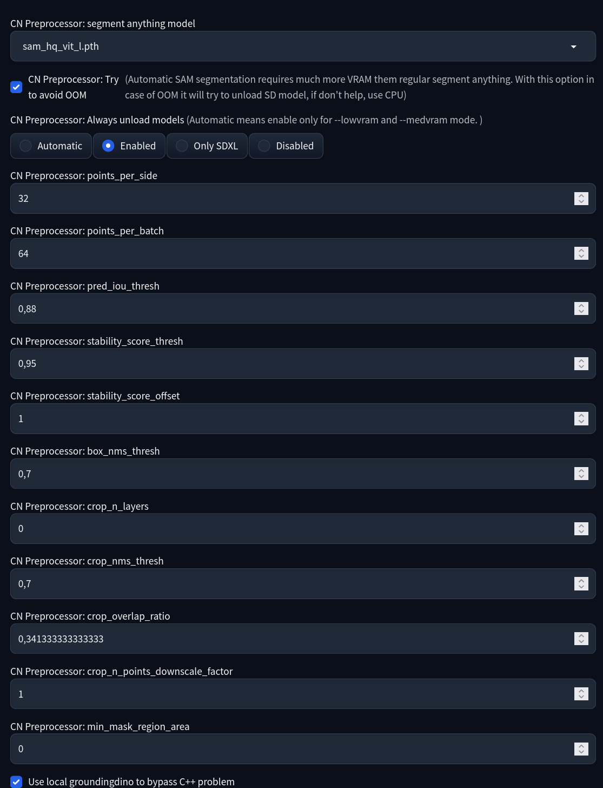

# Segment Anything module for ControlNet

This extension adds segment anything preprocessor inside [Mikubill/sd-webui-controlnet](https://github.com/Mikubill/sd-webui-controlnet) into [stable-diffusion-webui](https://github.com/AUTOMATIC1111/stable-diffusion-webui)

### Installation

1. Install [Mikubill/sd-webui-controlnet](https://github.com/Mikubill/sd-webui-controlnet) extension
1. Install [continue-revolution/sd-webui-segment-anything](https://github.com/continue-revolution/sd-webui-segment-anything) extension
1. Download [sam_hq_vit_l.pth](https://huggingface.co/lkeab/hq-sam/resolve/main/sam_hq_vit_l.pth) model and put it into `extensions/sd-webui-segment-anything/models/sam`
1. Install this extension
1. *Optional* download [this model](https://huggingface.co/mfidabel/controlnet-segment-anything/raw/main/diffusion_pytorch_model.bin), rename it into `controlnet-segment-anything.pth`, then put it into `models/ControlNet`

You can use this preprocessor with `controlnet-segment-anything.pth` controlnet model and also with regular segmentation controlnet and t2ia models [sd-controlnet-seg](https://huggingface.co/lllyasviel/sd-controlnet-seg), [t2iadapter_seg_sd14v1](https://huggingface.co/TencentARC/t2iadapter_seg_sd14v1), [t2i-adapter-sdxl-segmentation](https://huggingface.co/SargeZT/t2i-adapter-sdxl-segmentation), or even with [GWM_magic_draw_landscape_controlnet](https://civitai.com/models/253564/gwmmagicdrawlandscapecontrolnet) (SDXL)

ControlNet unit screenshot

Options

You can adjust Auto SAM options used in this module in the Segment Anything settings:

Extras tab

You can also use this preprocessor inside Extras tab with my other extension [sd-webui-cn-in-extras-tab](https://github.com/light-and-ray/sd-webui-cn-in-extras-tab)

